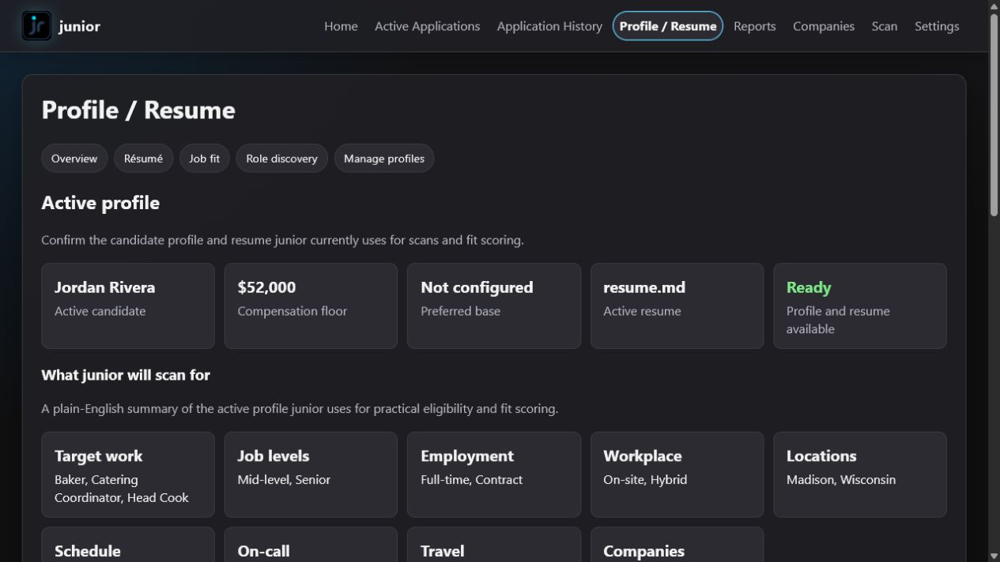
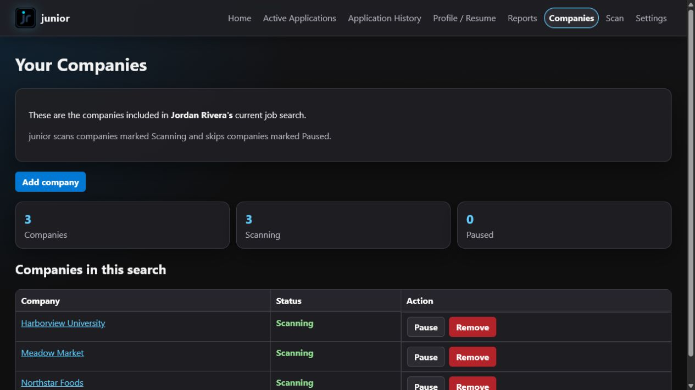
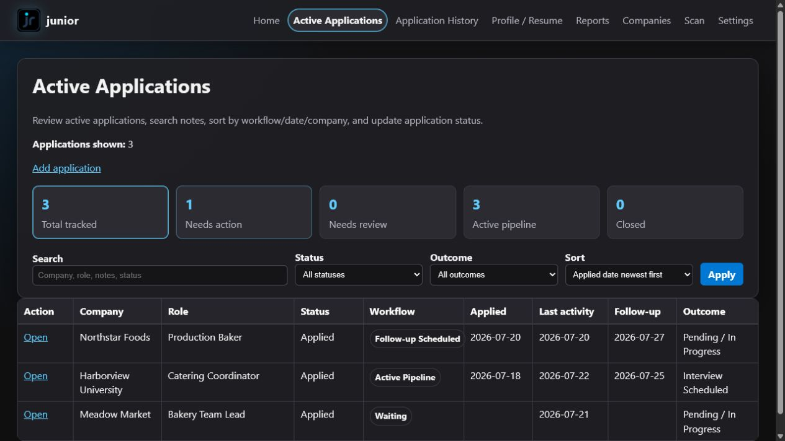

# junior

junior is a local-first job discovery, triage, reporting, and application-tracking tool.

It scans configured company career sites, normalizes and scores job postings, stores results in SQLite, and provides a local Flask interface for reviewing results, tracking active applications, and preserving application history.

junior does **not** apply to jobs automatically, contact employers, scrape LinkedIn, bypass authentication, or broadly crawl the internet.

## Status

- Current version: `0.2.0`
- Current field-test build: `RC6 Build 1.0`
- MVP completed and acceptance-tested: July 14, 2026
- Current development branch: `feature/productization-foundation`
- Python requirement: 3.11 or newer

The current development build is a functional local application with up to five independent managed profiles. Python wheel, source-package, reproducible Windows executable, unsigned per-user Windows installer, Linux archive, container, and Kubernetes baselines are implemented and validated. A genuinely empty installation now opens a guided first-run path through profile creation, résumé upload, profile-owned work exclusions, company selection, and a final review. The setup checkpoint is stored safely in SQLite, so closing junior during setup returns the user to the last completed step instead of starting over. The review shows the profile, résumé, preferences, locations, companies, user-data location, and scan behavior. Finish setup remains unavailable until Junior verifies minimum usable profile rules and confirms at least one selected company collector can connect. This validation imports, scores, recommends, reports, and emails no jobs, and it explains corrections in plain language. Publicly signed release downloads, remaining editable configuration, and broader release-candidate work are still in progress.

See [CHANGELOG.md](CHANGELOG.md) for released and unreleased changes.

### Product lifecycle

Junior is completing and stabilizing the current shared Python, Flask, and
pywebview product through version 1.0. That application will remain supported
as Junior 1.x while a future native desktop 2.0 is evaluated and built in
parallel. The native work is planned, not current functionality.

The 2.0 project will preserve Junior's shared scanning, scoring, profile,
company, tracker, history, report, diagnostics, scheduling, backup, and storage
services rather than creating different rules for a new interface. It will not
replace 1.x until workflow parity, safe data migration and rollback,
cross-platform behavior, performance, privacy, packaging, and field testing
are verified. See [the authoritative roadmap](docs/ROADMAP.md) and
[architecture documentation](docs/ARCHITECTURE.md) for the complete gates.

## Current capabilities

junior currently provides:

- configured-company scanning across multiple ATS and career-site formats
- Profile-owned active applications and application history stored safely in SQLite
- profile-owned scoring, occupation-neutral recommendation policy, compensation checks, and resume/profile matching
- structured scan snapshots and HTML reports
- plain-text and HTML email previews with guarded SMTP delivery
- a local Flask GUI with Home, Scan, Review Jobs, Reports, Active Applications, Application History, Profile / Resume, Companies, and Settings pages
- GUI-managed profile creation, editing, selection, guarded deletion, and app-owned resume storage
- profile-owned related-role discovery with evidence explanations and explicit user approval
- unified Profile / Resume workflow for profile creation, résumé management, profile-owned role, location, workplace, schedule, compensation, and travel selections, and occupation-neutral scoring ownership for newly created managed profiles
- tracker workflow states, follow-up dates, quick actions, bulk terminal updates,
  archive/restore workflows, and guarded deletion
- an unobtrusive Home dashboard option to share a Junior story or make an
  entirely voluntary Venmo donation that does not affect application behavior
- scan lifecycle records, progress state, cross-process locking, stage-specific failures, and bounded pagination
- non-blocking GUI scans with app-wide progress and completion notifications
- an installation-wide employer/source catalog with independent profile assignments and per-profile enable/disable control
- a global Collector Catalog shipped on every installation, automatic setup
  for supported ATS platforms including ADP, Recruitee, Workday, Oracle,
  Phenom, Eightfold, UKG Pro Recruiting/UltiPro, and a validated public-page
  fallback
- clickable Diagnostics details with safe latest-scan warnings, read-only
  company-source health, background connection testing, and selected-company
  scans that preserve the latest full-scan report
- user-owned runtime paths and non-destructive configuration/database bootstrap
- versioned SQLite migrations, foreign-key enforcement, atomic tracker/history moves, and backup-before-migration protection
- clean wheel installation and installed-package rendering tests

Application History is a permanent app-native feature. It is stored in SQLite and remains available for review, filtering, scan-time matching, prior-decision context, reporting, and tracker/history restoration workflows.

Managed profiles have separate Active Applications and Application History records. Switching profiles changes which records the GUI, scans, reports, and CLI use. Existing tracker and history records are assigned to the active managed profile during the protected database migration. A profile that owns tracker or history records cannot be deleted, preventing accidental loss of job-search data.

The completed RC5 work adds **Save for later**, **Pass / don't show again**, and
**I applied — track application** to every structured scan-result
classification. Saved and
passed jobs live in a separate profile-owned workspace; they do not become
applications or application-history records. Passing or saving hides that exact
source job from future reports for that profile and can be reversed later.
Individual review cards accept human-only notes of up to 300 characters and a
listed pass reason before Save or Pass. The Saved Jobs workspace keeps those
details editable, and multi-select actions remain all-or-nothing. Notes never
alter scoring. Eligibility retains
explicit work location, temporary or contract duration, employment type,
schedule, compensation, and work-authorization details when the posting
provides them. A concrete city, named office, or city/state suffix in a title is
treated as location-bound when the posting does not explicitly state that the
job is remote. Those jobs are compared with the profile's selected locations
instead of flooding Review Needed as unknown. Review cards show workplace
arrangement and location separately at a glance. Unresolved practical facts
remain in Review Needed rather than being guessed.

Company discovery is also an RC5 release gate. Junior must combine known ATS
patterns, redirects, page metadata and links, structured data, custom domains,
and compatible collector probes rather than depending on one generic fallback.
An optional global Bing fallback defaults off and is never required for company
setup or normal scans. It must verify a credible job result before saving an
employer and discard unsuccessful probe data when the request finishes. The
setup result distinguishes an unavailable optional service from a completed
lookup that produced no independently verified source.

Junior owns application identifiers. The internal Job Radar ID is hidden from
normal forms and reports. A scan-linked application reuses the identifier
assigned during collection, while an application entered manually from
LinkedIn or another outside source receives a new Junior-managed ID when the
user selects Save. Normal users never invent or maintain it.

RC5 now separates bookmarked jobs from applications. **Save for later** keeps a
profile-owned job for later review without claiming the user applied. **Pass**
moves a job into the profile's Reviewed Jobs view and prevents that exact
posting from returning in future reports. **I applied — track application**
opens the application workflow with Junior's scan-owned ID and source details.
Active Applications and Application History remain limited to jobs the user
actually applied for. Junior's recommendation label **Needs your review** is
not the same as the user's saved state.
Home shows the active profile's combined Saved and Reviewed count, breaks it
down into saved and reviewed totals, and links directly to that workspace.
Scan completion now opens **Review Jobs**, an inbox containing only jobs from
the latest scan that still need the user's decision. Saving, applying, or
passing removes the job from this inbox, and later scans do not reset that
durable profile-owned action. Interactive Top Matches, Potential Top Matches,
Review Needed, and New Jobs groups remain organized by the scan's
classification. Top Matches retain confirmed practical eligibility. Potential Top
Matches already satisfy the profile's existing top-match score and strong-signal
rules but list the practical facts still awaiting confirmation; no threshold is
lowered and no internal score is shown. Each group loads at most 20 full job
cards per page. Review Needed also offers a compact view with at most 50
collapsed job summaries per page, page-only Select all, matching navigation at
the top and bottom, and a Back to top link that never changes pages or clears
selections. Numbered page links allow direct movement between distant pages.
Jobs on each page are grouped into collapsible company sections; a company
that spans pages shows both the number on the current page and its total in the
result group. Expanding or collapsing a company does not reload the page or
clear selected jobs. Every compact summary can expand to the same Save, Pass,
Apply, Notes, and evidence controls. Explicit workplace,
employment-type, and annual-pay wording in a description can fill a missing ATS
field. An omitted schedule does not imply a conflict, while an explicit night,
evening, weekend, or on-call requirement is still enforced.
Creating an application from Review Jobs returns to the same review group and
marks that scan job as applied. Home and Review Jobs counts show undecided work
remaining, rather than repeating jobs already saved, applied, or passed.
**Reports** is a separate page for the latest generated HTML report, email
preview, compressed raw-scan download, and retained report history. New
installations retain the latest 10 successful report runs by default. Existing
installations keep their current retention setting until the user changes it.

### RC6 collection and evaluation

RC6 Build 1.0 makes collection and job evaluation more complete and more
trustworthy:

- Workday collection no longer stops after 40 jobs when a later page
  incorrectly reports a total of zero. Pagination continues until Junior
  reaches the real end of the listing, while repeated-page detection prevents
  endless collection. The same protection applies to Eightfold.
- Junior evaluates required qualifications and the work described in the job
  posting, not merely a loose collection of matching words. It distinguishes
  required qualifications from preferred or bonus qualifications.
- The active profile's target roles now participate directly in role-family
  alignment. Clearly unrelated work and central missing disciplines become
  critical gaps and are omitted instead of being sent to Review Jobs.
- A Top Match requires strong or very strong résumé evidence, confirmed
  practical eligibility, and no more than one non-critical gap. Strong jobs
  with unresolved practical facts remain Potential Top Matches.
- Safe scan diagnostics record per-company collection and evaluation totals,
  including broad omission categories, without recording job descriptions,
  profile contents, résumé contents, or credentials.

These rules are occupation-neutral. They use each profile's own target roles,
résumé evidence, gaps, and exclusions rather than globally hard-coded
technology preferences.

### Distribution and support improvements

RC6 is planned to improve distribution and tester support without weakening
Junior's local-first or user-controlled behavior:

- The manual **Check for updates** action is build-aware. In the installed
  Windows desktop app, a separate **Download and install update** action
  downloads only the exact installer and checksum published on Junior's
  official GitHub release, verifies the SHA-256 checksum, closes Junior, runs
  the installer, waits for its result, and explicitly reopens the app. Junior
  then keeps a plain-language success or failure notice visible until the user
  dismisses it. A sanitized **Update activity** log records the handoff,
  installer result, and restart stage without storing paths, download
  addresses, or raw errors. Checking alone never downloads or installs
  anything. Browser,
  server, and development modes provide the verified release link instead of
  self-updating. Profiles, résumés, companies, applications, and history remain
  in the separate user-data directory.
- Diagnostics will gain a **Contact support** action. Junior will prepare a
  sanitized diagnostic bundle, open the user's default email application with
  safe version and operating-system context pre-filled, and tell the user which
  file to attach. Junior will not attach or send anything automatically, and
  the workflow will warn against sending résumés, databases, credentials,
  tokens, profile contents, or other private information.
- Junior will add and validate an MSIX package for Microsoft Store
  distribution. The Store version is intended to remain free to users and use
  Microsoft-managed package signing and updates. The existing open-source
  repository and direct GitHub release channel will remain available.
- The project will apply to the SignPath Foundation open-source program for
  free signing of GitHub-distributed releases. This requires a verifiable
  GitHub Actions build, explicit signing approvals, documented project roles,
  and public privacy and code-signing policies. If Junior is not accepted,
  Microsoft Artifact Signing will be reassessed before purchasing a commercial
  certificate.

MSIX readiness requires more than converting the installer format. Store
acceptance work must verify first installation, launch, icons, external links,
notifications, clean shutdown, user-data paths, SQLite and credentials,
scheduled scans, upgrades, rollback and recovery, and uninstall behavior.
Existing user-owned data must remain outside the application package and must
not be removed by an update, repair, or uninstall.

The Contact support, MSIX, and signing items above remain planned RC6
capabilities and are not implemented in RC6 Build 1.0. Diagnostics still
requires the user to download and attach a sanitized log manually. Interactive
company-source discovery writes a separate bounded
`junior-company-discovery.log` containing only public hostnames, collector
families, safe outcomes, counts, and timestamps.

### Planned RC7 language assistance

RC7 is governed by one product rule:

> **Junior explains. Junior does not decide.**

The first and only planned language-model capability is **Explain this job**.
It may translate a posting and Junior's existing structured evidence into a
plain-language explanation for the user. It will not learn preferences, change
scoring, modify a profile, approve or reject a job, pass or save a job, expand
a search, or make an application decision.

Local processing is preferred. Any online provider must remain disabled by
default and require clear, informed user setup before selected information
leaves the computer. Junior's normal scanning, scoring, review, and application
workflows must remain fully usable when language assistance is disabled or
unavailable. This is planned behavior, not part of the current RC5 build.

## Quick start for development

```powershell
cd C:\dev\job-radar
.\.venv\Scripts\Activate.ps1
.\.venv\Scripts\python.exe -m pip install -e .
.\.venv\Scripts\python.exe -m job_radar.web_app --settings config\settings.yaml
```

Open:

```text
http://127.0.0.1:5000/
```

The installed console entry point is also available:

```powershell
job-radar-web --settings config\settings.yaml
```

## Common commands

Validate configuration:

```powershell
.\.venv\Scripts\python.exe -m job_radar validate --config config\target-companies.yaml --settings config\settings.yaml --scoring config\scoring.yaml
```

Run a scan:

```powershell
.\.venv\Scripts\python.exe -m job_radar scan --config config\target-companies.yaml --settings config\settings.yaml --report reports\target-scan.html --email-preview reports\target-email-preview.txt
```

Summarize application history:

```powershell
.\.venv\Scripts\python.exe -m job_radar history summary --settings config\settings.yaml
```

List active applications:

```powershell
.\.venv\Scripts\python.exe -m job_radar tracker list --settings config\settings.yaml
```

Create a new user-owned junior workspace:

```powershell
.\.venv\Scripts\python.exe -m job_radar bootstrap-user-data
```

This creates safe starter settings, an empty company list, and occupation-neutral scoring structure. It does not copy a profile, résumé, database, credentials, another user's occupational scoring rules, or the repository's live company list.

Existing settings, companies, scoring rules, profiles, or a database can be brought over only by supplying the matching optional `--source-*` argument.

junior uses bootstrapped user settings by default when they are present. The established `JOB_RADAR_DATA_DIR` compatibility name remains unchanged so existing installations and user data continue to work.

## Validation

GitHub Actions automatically runs two repository checks for pushes and pull
requests involving `main` or `feature/productization-foundation`:

- **Python validation** uses Windows and Python 3.13 to run Ruff and the complete
  Python test suite.
- **Secret scanning** uses the checksum-verified Gitleaks 8.30.1 release to scan
  all reachable Git history. Findings are redacted, and the temporary report is
  removed before the job ends.

Both workflows use read-only repository permissions, do not persist checkout
credentials, and can also be started manually from GitHub's Actions page. These
remote checks supplement rather than replace the local validation required
before a commit or release.

Run Ruff:

```powershell
.\.venv\Scripts\python.exe -m ruff check job_radar tests
```

Run the full test suite:

```powershell
.\.venv\Scripts\python.exe -m pytest -q tests
```

Run the complete automated Windows release gate:

```powershell
.\scripts\validate_release.ps1
```

This runs the full suite and lint checks, builds a fresh unsigned installer,
and validates install, repair/upgrade, uninstall, and synthetic user-data
preservation without using the active Junior workspace.

Validate the finished Windows and Linux packages in clean environments:

```powershell
.\scripts\validate_clean_packages.ps1
```

This launches the installed Windows executable with isolated empty data and
runs the Linux archive in a Python-free Debian container.

Validate long-term responsiveness with a disposable fictional workspace:

```powershell
.\.venv\Scripts\python.exe scripts\validate_performance_scale.py
```

The default gate creates 100 fictional companies, 100,000 jobs, 10,000
historical applications, 2,500 active applications, and five profiles. It
checks the database access paths used by normal profile-owned workflows and
removes the complete temporary workspace afterward.

Before publishing a release candidate, complete the normal-user walkthrough in
[`docs/RELEASE_CHECKLIST.md`](docs/RELEASE_CHECKLIST.md). It covers the exact
installer artifact from checksum verification through guided setup, first
report, application tracking, restart, update checking, backup, restore,
repair/update, uninstall, and byte-for-byte preservation of isolated user data.

Packaging validation is covered by `tests/test_packaging.py`, including clean-wheel installation, installed desktop-launcher startup, and installed web rendering outside the source tree.

Build the unsigned Windows desktop bundle:

```powershell
.\scripts\build_windows.ps1
```

The reproducible PyInstaller recipe creates
`artifacts\windows\Junior\Junior.exe` plus its required private runtime files.
It does not contain profiles, resumes, databases, credentials, reports, logs,
or other user-owned data.

Build the unsigned per-user Windows installer:

```powershell
.\scripts\build_windows_installer.ps1
```

The resulting `artifacts\installer\Junior-Setup-0.2.0-RC6-build-1.0.exe` installs under the
current user's local application area, adds a Start Menu shortcut, and offers
an optional desktop shortcut. Uninstall removes application files but preserves
Junior's separate user-data directory. Code signing and public release
distribution remain later release work.

Validate install, repair/upgrade, and uninstall preservation using only
disposable data:

```powershell
.\scripts\validate_windows_upgrade.ps1
```

The validation hashes representative user-owned files before and after each
operation. It fails if any file is added, removed, or changed.

Build the Linux x86-64 tarball from Windows using Docker Desktop's Linux
engine:

```powershell
.\scripts\build_linux_tarball.ps1
```

The resulting `artifacts\linux\Junior-linux-x86_64.tar.gz` contains Junior's
portable application bundle plus `launch-junior.sh`, `install.sh`, and
`uninstall.sh`. The Docker context explicitly excludes configuration,
databases, profiles, résumés, reports, logs, and other user-owned data.

On Linux, extract the archive and run:

```sh
sh Junior/install.sh
~/.local/bin/junior
```

The launcher checks for Linux and a WebKit GTK desktop library before opening
Junior. Uninstall with `sh Junior/uninstall.sh` from the extracted archive, or
the installed copy, to remove application files while preserving user data.

### Container/server mode

Run Junior with its included Compose definition:

```powershell
docker compose -f packaging\container\compose.yaml up --build
```

The example exposes Junior only at `http://127.0.0.1:8000`, runs as a non-root
user, and stores all durable state in the `junior-data` volume mounted at
`/var/lib/junior`. Recreating or upgrading the application container preserves
that volume. Startup creates only missing safe defaults and then uses Junior's
normal database migrations and shared Flask/service code.

`GET /health` returns only the application name, readiness state, and installed
version. Container logs go to standard output/error while Junior-owned logs
remain under the mounted data root. Credential values must be injected through
approved environment-variable references or an external secrets mechanism;
never bake them into an image or Compose file.

Junior's web interface does not currently provide user authentication. Keep
container mode bound to localhost or behind a separately secured private
network boundary. Do not publish port 8000 directly to the public internet.

### Kubernetes mode

The operator-ready baseline is under `packaging/kubernetes`. Apply it with
Kustomize only after replacing `junior:0.2.0` with the exact immutable image
tag or digest being deployed:

```powershell
kubectl apply -k packaging\kubernetes -n junior
```

The baseline uses one non-root application replica, a persistent volume,
private ClusterIP networking, privacy-safe health probes, and suspended scan
and backup CronJobs. The single replica and `Recreate` upgrade strategy are
deliberate: Junior uses SQLite and must not have multiple application pods
writing to the same database. Create secret values outside source control and
enable each CronJob only after reviewing its schedule.

Scheduled backups retain the 14 newest scheduler-created bundles on the Junior
volume and never prune manual or pre-change safety backups. Because those
bundles share the same persistent volume, the cluster operator must also copy
backups to independent protected storage. A backup on a lost volume is not
disaster recovery.

Junior has no built-in web authentication. Keep the Service private or place
it behind an authenticated ingress on a trusted network; never expose it
directly to the public internet. Preserve and independently back up the
persistent volume during upgrades.

### Fictional demo workspace

Documentation, demonstrations, and release checks must never use a real
profile, resume, employer list, application, or job-search database. From a
development checkout, create a separate fictional workspace at a new path:

```powershell
.\.venv\Scripts\python.exe scripts\create_demo_workspace.py C:\temp\junior-demo
```

The command refuses any destination that already exists. It does not inspect
or copy the normal Junior user-data directory. The generated workspace contains
the fictional Jordan Rivera profile, fictional employers, a short fictional
resume, sample scan records, active applications, and application history.

Run Junior against only that workspace:

```powershell
cd C:\temp\junior-demo
C:\dev\job-radar\.venv\Scripts\python.exe -m job_radar.web_app --settings C:\temp\junior-demo\config\settings.yaml
```

Use a different empty destination for each validation run. Delete only the
disposable destination after confirming it is the generated fictional
workspace.







The desktop launcher holds one operating-system lock per Junior user-data workspace. Launching Junior again reads the first process's local-only address, waits for it to become ready when necessary, and opens that interface instead of starting another server against the same database. A crash releases the operating-system lock; the small lock file itself is not treated as proof that Junior is running.

Closing the desktop window requests a clean local-server shutdown. If a GUI scan is active, Junior keeps the process and instance lock alive until the scan worker finishes its protected database and report writes. The internal shutdown endpoint remains available to the desktop shell, but Settings does not show a redundant Exit card.

The desktop launcher now uses pywebview to place the same local Flask interface inside a normal native window. It does not create a second UI. A first launch opens at the reviewed 1440 by 900 pixel size, with a 960 by 640 minimum. When the user closes the native window, Junior stores only its size and screen position in the user-owned runtime directory and restores that geometry on the next launch. Missing or invalid state returns safely to the reviewed default. Windows, Linux, and macOS must share the same pages, controls, layouts, validation, typography, and workflows; only genuinely native window chrome, dialogs, notifications, and keyboard conventions may differ. Use `job-radar-desktop --browser` when deliberate browser-based local use is preferred, or `--no-browser` for an externally managed local server. PySide6/QWebEngineView remains the documented fallback if cross-platform testing proves system webview rendering cannot satisfy that shared-interface requirement.

The shared page shell supports keyboard users with a visible-on-focus skip link, strong focus indicators on interactive controls, and a programmatically identified current navigation page. It also provides a mobile/zoom viewport, narrow-window wrapping, forced-color control borders, and screen-reader captions for application data tables. Profile occupation and location suggestions expose their expanded state and work with Enter, Escape, arrow keys, Tab, or a pointer. Automated checks require every visible form control to have a programmatic label and protect WCAG AA contrast for shared text, links, statuses, and actions.

## Configuration and private data

Safe starter files included in the install package:

- `job_radar/bootstrap_defaults/settings.yaml`
- `job_radar/bootstrap_defaults/scoring.yaml`
- `job_radar/bootstrap_defaults/target-companies.yaml`

Development and live-validation configuration remains under `config/` and is not used as the installed application's automatic starting data.

Runtime databases, reports, logs, private settings, resumes, profiles, and credentials must remain outside source control.

Managed profiles and uploaded resumes are stored inside junior's user-data area. Uploaded resume files receive stable app-owned names, so renaming or moving the original file does not break the active profile. Existing YAML profiles remain supported when no managed profile is selected; junior does not automatically migrate or replace them.

A controlled migration service can prepare an existing YAML profile for managed storage, but migration is not automatic or exposed as a normal GUI action yet. It creates a private recovery bundle containing the source profile, resume files, and a consistent SQLite backup before creating or selecting the managed profile. Real user-data migration requires a separate backup-and-rehearsal step and explicit approval.

The Profile / Resume page is a read-only home for selecting profiles and reviewing the active profile, résumé insights, and a plain-English summary of what junior is intended to find during targeted company scans. A compact profile selector supports switching, editing, creating, and guarded permanent deletion. junior supports up to five profiles; deleting one also removes its Junior-managed résumé and requires the same typed `DELETE` confirmation used for application deletion. Dedicated create and edit pages keep data entry separate from the summary; Cancel and Back return without saving, and only an explicit Create profile, Save changes, or Save résumé action writes the corresponding change. When no profile exists, the summary page directs the user to create the first one. This workflow does not run a search and is not a broad job-board filter. It stores normalized occupation identities, structured U.S. locations and commute radii, job levels, employment types, schedule, on-call availability, security-clearance handling, workplace arrangements, minimum compensation, travel percentage, and optional work exclusions in SQLite. Workplace choices include Remote, Hybrid, On-site, and Flex. Flex applies only when an employer explicitly describes a flexible workplace arrangement or work model; flexible hours remain a separate schedule preference. A clear requirement for an existing active clearance follows the profile's choice; ambiguous clearance wording is placed in Needs Review instead of being guessed. Exclusions describe roles or responsibilities the user does not want; duplicate lines are normalized and the existing profile evidence boundary evaluates them without assuming that similar-sounding titles mean the same work. Selected locations use approximate straight-line distance to define acceptable hybrid, on-site, and flex commutes. Truly remote jobs ignore commuting distance, while an employer's remote residency restriction must match a location where the user lives or genuinely plans to move. Newly created managed profiles own an occupation-neutral scoring configuration instead of inheriting another user's role, skill, location, or exclusion assumptions. The saved practical preferences do not yet generate the complete scoring and recommendation policy; that integration remains in progress. The former `/preferences` address redirects to Profile / Resume for compatibility. Occupation suggestions use the O*NET 30.3 Database under CC BY 4.0; location suggestions and radius coverage use the U.S. Census Bureau 2025 Gazetteer Files, with display prioritization from the Census Bureau Vintage 2025 Population Estimates. junior includes only the reference fields needed by this workflow and has modified their packaging and presentation.

The active managed profile also has a Related Roles workspace. Junior can suggest adjacent titles from packaged O*NET occupation descriptions when the profile's résumé contains supporting work evidence, or from job descriptions previously observed during that profile's own scans. Similar wording alone is not enough. Suggestions tied to an observed employer retain that company context because one title can describe different disciplines at different companies. Every suggestion shows a plain-language explanation and the matched evidence terms. The user must choose **Relevant**, **Not relevant**, or **Different discipline**; only Relevant mappings join the existing target-role boundaries used by company recommendations. No internal score is shown, no suggestion is approved automatically, and the feature does not alter the established job-scoring formula. Junior stores the suggestion, short displayed evidence terms, and feedback in the profile-owned database; it does not store another raw copy of the résumé.

Each profile owns its own company search list. The Companies workspace shows only the active profile's employers and labels each one Scanning or Paused according to that profile's assignment. Existing upgrades complete their pending one-time YAML company import during application startup, before Profile, Companies, or Recommendations can show an empty profile-owned workspace. A user can add a company using its ordinary name or public careers URL. Junior first checks exact catalog names, aliases, normalized careers URLs, and known source identifiers. Exact existing matches require the user to choose the employer. For a confidently recognizable public career site, Junior shows the detected provider and company identity and requires explicit confirmation before creating or assigning anything. Confirmation rechecks the submitted address on the server and runs a bounded real collector test; Junior saves the source only when that test returns a credible public job. Branded pages are inspected for supported recruiting-platform links and metadata before the generic public-page fallback is attempted. If a landing page is blocked or separate from the employer's real job site, Junior may make a bounded public lookup using only the submitted company name and public domain. Candidate URLs and failed probes remain in memory for that request and are discarded; only the verified working source and its current health are stored. The Add Company page shows an animated checking state during this work. Individual public requests remain bounded, and unfamiliar-source discovery stops after two minutes. A timeout saves no employer or profile assignment and gives the user a safe retry message. Ambiguous names require the user to choose an exact match, while unsuccessful setup attempts can be retried or safely removed. The company detail page shows the safe source status, recruiting platform, last check, and returned-job count, and allows a normal user to rerun the non-destructive source test without exposing collector settings or raw failures. It can also keep optional shared Website, Careers, LinkedIn, and Glassdoor shortcuts. Junior opens those public links in the normal browser; it does not log in to, query, monitor, or scrape those services, and changing a shortcut does not change the validated job collector. The new profile assignment starts as Scanning. Employers that are already assigned, unavailable, or missing required setup cannot be added. A user can pause, resume, or remove an assigned company without changing the shared employer definition or another profile's choice. **Remove from this profile** requires typing `REMOVE`, stops future scans only for the active profile, and preserves collected jobs, applications, history, reports, and other historical records. Global employer deletion remains guarded in Administration. The Profile / Resume summary shows the same company count and links to the workspace. When no managed profile is active, the Companies page directs the user to create or select one and does not display legacy YAML configuration. Released CLI/server YAML scan compatibility remains available.

Junior does not present its local Employer Catalog as a comprehensive recommendation system. Users choose the employers they want to monitor. The Companies workflow is designed to make that addition easy: enter an ordinary company name or public careers-page URL, review Junior's detected match or supported career platform, confirm it, and begin scanning. Junior does not invent employer names, silently add companies, broadly crawl the public web, or claim to know the full market for a profession or region. Its source-discovery fallback is limited to locating and validating the public job site for the employer the user explicitly submitted. Existing recommendation metadata and Administration services remain available for compatibility and technical maintenance, but they are not part of the normal-user company workflow.

An optional profile setting can surface exceptional matches outside the user's
selected locations. It is off by default. A role must already satisfy Junior's
strong-match rules and have location as its only blocker. These roles appear in
a separate review group and never become Top Matches automatically.

## Settings and Administration boundary

Settings remains the normal-user home for safe personal and product preferences. Its About card shows the installed version, release channel, user-data location, database and profile schema versions, and safe support guidance without exposing profile contents or credentials. A manual update check reads Junior's official GitHub release information and reports the result without downloading anything. When a newer supported Windows desktop build is available, the user may separately approve downloading its official installer, verifying its SHA-256 checksum, closing Junior, installing the update, and reopening the app. Browser, server, and development modes do not install updates. Email setup stores credentials through the operating system rather than ordinary settings or SQLite. The global Company Discovery setting can optionally allow a Bing lookup only after Junior's direct company-source checks fail. It defaults to Off, is not required for normal scans or direct source detection, and explains the exact public company information sent and the provider-visible network information before the user enables it. Scan schedule setup stores an enabled state, local start time, selected weekdays, and email-delivery choice; it shows the calculated next run and safe status from the most recent scheduled scan. On Windows, the same page manages Junior's single `\Junior Scheduled Scan` Task Scheduler entry with normal user permissions and no stored Windows password. Junior's window may be closed and the computer may be locked, but the Windows user must remain signed in and the computer must be awake and powered on at the scheduled time. On Linux, it atomically manages only the marked `junior-scan.service` and `junior-scan.timer` files in the current user's systemd directory and refuses to overwrite similarly named files it does not own. Both platforms start the same `job-radar-scheduled` entry point and shared scan service. The Linux user timer can also run under a dedicated server service account with that account's explicit Junior data root; full logged-out service installation guidance remains part of the later Linux operations milestone. Administration is a separate, session-scoped safety boundary for installation-wide and technical controls. Unlocking Administration requires typing `ADMIN`; this is an explicit confirmation, not a password or protection from someone who already controls the local computer. Administration unlock state is limited to the current browser session and Junior process, and restarting Junior invalidates it. The Flask session signing key is generated locally under the user-owned database runtime directory. It is never committed or stored in YAML or SQLite; deleting it invalidates existing browser sessions.

Every unlocked Administration subpage includes an explicit **Back to Administration** link. Junior also uses consistent page spacing and themed scrollbars across the browser and desktop interfaces. Developer-oriented scan commands and resolved paths remain available on the Scan page under a collapsed technical-details section so they do not interrupt the normal scan workflow.

| Classification | Controls |
|---|---|
| Normal Settings | Email setup, report retention, scan preferences, ordinary interface preferences, scheduling preferences, and safe user-facing defaults |
| Administration | Employer Catalog and collector configuration, runtime paths, database operations, backup and restore, legacy import and migration, raw diagnostics, support bundles, and installation-wide defaults affecting every profile |
| Undecided / future | The final placement of support links, bounded diagnostic summaries, and recovery guidance will be decided when those workflows become editable |

The Settings page keeps runtime paths read-only while providing normal-user controls for email, scheduling, retention, and safe diagnostics. Its Diagnostics page summarizes application configuration, the latest scan, company sources, and email delivery with green, yellow, red, or neutral status cards. Problems are categorized as configuration, collector, network, email, or unexpected application failures and include a plain-language next step. A separate developer-log pane shows one recognized Junior-owned log at a time as timestamped structured text and downloads a complete `.log` copy without simplifying or dropping safe fields. The on-screen view is limited to the newest 200,000 bytes. It is not a general file browser: nested paths, arbitrary logs, editing, deletion, and unrestricted downloads are rejected. Job descriptions, profile and résumé contents, credentials, tokens, environment contents, request headers, and raw exception text are neither stored in these logs nor displayed. Administration includes the global Employer Catalog, where an unlocked administrator can create and edit structured employer-source settings, run bounded local validation, test the real collector connection without importing jobs, and enable, disable, or retire an employer. A connection test records the last attempt, last success, last problem, returned-job count, and a safe troubleshooting category. It never stores raw collector or network error text, and editing source settings clears stale connection health. The employer detail page can assign an available, validated employer to any managed profile or remove one profile's assignment without affecting another profile or deleting collected history. Permanent deletion requires typing `DELETE` and is permitted only when no profile assignment or collected job references the employer; otherwise the administrator must disable or retire it. The Employer Review Queue lets unresolved profile submissions be matched to an existing employer, used to prefill a new employer, assigned after availability checks, or closed as unsupported, rejected, or duplicate. Recommendation Administration provides employer/profile diagnostics, global employer recommendation metadata and eligibility, profile-specific feedback inspection and guarded reset, and explicitly bounded rebuilds for one profile, one employer, or every profile. Recommendation maintenance has a sanitized audit and does not silently override profile feedback. Review decisions have a sanitized audit trail. New and edited employers must validate before they can be globally enabled. Disabling or retiring preserves profile assignments and collected history; an unavailable employer is omitted from scans until it is enabled again. Packaged company defaults are empty for new installations. Existing legacy definitions import only once into the active profile, never replace a user-edited database employer with the same stable ID, and remain separate from later user-owned catalog changes. Other Administration categories remain planned.

Developer logs retain allowlisted scan, decision, company-discovery, update,
and startup events as dated records. New structured operational events identify
their schema, Junior version and build, subsystem, severity, stage, status,
counts, timing, and safe failure category when those facts apply. The viewer
and complete timestamped `.log` downloads use conventional one-line structured
text: timestamp, severity, subsystem, event, and detailed `key=value` fields.
A developer can inspect every retained safe field
without exposing job descriptions, profile settings, résumé contents, secrets,
environment contents, request headers, or raw exception text.

Companies is the normal working area for both profile membership and company
source health. Each row shows whether the company is scanning, which collector
it uses, the latest scan result, and the latest bounded connection-test result.
Users can pause or resume a company, test one or more sources without importing
jobs, and remove a company from only the active profile without deleting its
history. Connection-test progress and individual results refresh on that same
page. Diagnostics summarizes overall source health and links directly to this
workspace when action is needed.

Actual selected-company scans belong on the Scan page, separately from
connection tests. A user can expand **Scan selected companies**, choose up to
25 enabled companies from a compact table, and run the same collection,
deduplication, scoring, and Review Jobs import used by a full scan. The
selected scan writes its own targeted report instead of replacing the latest
full-scan report. Stable job identity prevents duplicate records, while
existing Save, Pass, and Apply decisions continue to suppress already-decided
jobs. A separate collapsible results summary shows the newest scan totals and
plain-language company-source warnings. Runtime paths and developer command
details remain in Diagnostics rather than the normal Scan workflow.

Green means working, yellow means incomplete or needs review, red means an
actual source failure, and neutral means not yet tested or not included in the
latest scan. Safe
failure explanations distinguish an unreachable source, denied public request,
missing address, temporary request limit, recruiting-service problem, and a
collector that could not interpret the returned job list.

Every state-changing web form and background action uses a session-bound CSRF token. Junior rejects missing, invalid, or stale tokens before route business logic runs, so the attempted change is not written. Normal forms receive a plain-language recovery page; background requests receive a bounded JSON error. Refreshing the page creates or loads the current token and allows the user to review and resubmit. GET routes remain read-only.

A successful scan writes fixed-name outputs in the user-owned `reports` directory. The latest HTML report, structured snapshot, email preview, and compressed raw-scan ZIP keep stable filenames. The HTML and email outputs summarize relevant results so thousands of unrelated or omitted postings do not make the normal report unreadable. The raw-scan ZIP contains a normal text file with every public posting collected in that run, including its public description, for download and offline review; Junior does not render that large file in the GUI. A failed or interrupted scan does not replace the last valid result. Profile-owned actions taken from scan data persist separately: saved jobs, passed jobs, tracked applications, and application history remain after reports are replaced and continue to suppress already-decided jobs from Review Jobs. New installations retain the latest 10 successful report runs by default. Existing installations keep their saved policy and may choose latest only, latest plus previous, or a total from 1 through 50. Before replacement, Junior copies and verifies the prior complete set in its marked `reports/archive` directory. The Reports page provides direct downloads for current and retained exports. Because raw ZIPs can grow with employer and job volume, Settings shows the retention control and lets the user reduce the number kept. The same Settings page limits recognized dated Junior logs while preserving active logs and unrelated files. Reduced limits are enforced on the next successful scan.

Scans started from the GUI run in the background. The rest of junior remains available while a scan is running, and every page monitors the same durable scan status. An app-wide notification reports completion, completion with source warnings, or failure and links to the appropriate results or details.

SMTP passwords must not be stored in YAML, SQLite, logs, reports, previews, bootstrap files, packages, or source control. Junior can store desktop credentials in the operating system's credential manager through the packaged `keyring` adapter; settings retain only the non-secret `smtp_credential_key` reference. The established `smtp_password_env` environment-variable reference remains supported for existing installations, servers, containers, and automated deployments. If the operating system has no usable secure credential backend, Junior reports that credential storage is unavailable and does not fall back to a plain-text file.

Settings includes an Email Setup page with Gmail, Outlook, and Custom SMTP choices, username and password entry, sender and recipient delivery details, and a clear credential-storage status. Gmail and Outlook use their standard SMTP server, port, and transport-security defaults; provider policy may require an app password or separately enabled SMTP access. Saving validates a complete replacement settings file before atomically activating it, preserves unrelated and newer settings keys, and writes a newly entered password only to the operating-system credential manager. **Test Connection** connects, negotiates TLS when configured, and authenticates without sending a message, launching a scan, or producing a normal report. A session-scoped status card shows the tested provider, result, time, credential-storage method, and a short reason. Ordinary results are limited to Connected, Not configured, Authentication failed, Server unreachable, or TLS negotiation failed; the browser session contains no password or raw SMTP failure.

The downloadable `junior-last-scan.log` records the newest scan's stages,
collector types, counts, safe failure categories, and elapsed time.
`junior-diagnostics.log` retains a bounded operational history. Neither log
contains job listings, employer names, submitted URLs, profile settings, or
résumé contents.

## Database upgrade recovery

Before changing an existing database structure, junior creates a backup in the `backups` directory beside the active database. The established default Windows location remains `%LOCALAPPDATA%\JobRadar\data\backups`. Backup filenames identify the database and migration range, for example `job_radar.sqlite3.pre-migration-v1-v3-<timestamp>.bak`.

If junior reports an upgrade failure, close junior and do not delete, rename, replace, or repeatedly reopen the active database or its backups. Preserve the complete `data` directory and contact Clayton Graves at `claytonmgraves@outlook.com`. Include the displayed technical details and diagnostic-log location, but do not send the database, résumé, profile, passwords, access tokens, or other credentials unless an approved secure support process is provided.

Unlocked Administration provides a **Backup and recovery** screen. Its backup action creates a verified `.jrbackup` bundle and downloads a portable copy through the application. The bundle contains a consistent SQLite copy plus Junior-owned settings, company/scoring configuration, managed profile and résumé files, reports, and sanitized logs. Junior validates the manifest, file paths, sizes, checksums, and database before restoring into the same or a separate installed workspace. It creates a separate pre-restore safety backup first and tells the user to restart after success. The source workspace remains unchanged. Credentials remain in Windows Credential Manager or their configured environment variable and are never included. The same screen can download a readable JSON database export; that export is for review and portability and cannot be used as a restore bundle.

Junior also creates safety backups automatically immediately before an eligible permanent profile or company deletion. Profile deletion preserves the complete workspace because the profile and managed résumé span SQLite and files; company deletion preserves a verified SQLite copy because the employer catalog is database-owned. Invalid confirmations and in-use records are rejected before a backup or deletion occurs. Existing schema upgrades continue to create their established pre-migration backups.

## Acknowledgements

### Early Field Testing

Special thanks to Dawn Peacock for extensive early usability testing and
workflow feedback that directly shaped the RC5 review workflow, job management
model, and company discovery improvements.

## Documentation

- [User Guide](docs/USER_GUIDE.md)
- [Development Guide](docs/DEVELOPMENT.md)
- [Architecture](docs/ARCHITECTURE.md)
- [Security and Privacy](docs/SECURITY.md)
- [Roadmap](docs/ROADMAP.md)
- [Release Checklist](docs/RELEASE_CHECKLIST.md)
- [Changelog](CHANGELOG.md)

## License

Junior is free software licensed under the GNU General Public License,
version 3.0 only (`GPL-3.0-only`).

See [LICENSE](LICENSE) for the complete license terms. Third-party components
and reference data retain their own licenses and attribution requirements,
which are inventoried in
[THIRD_PARTY_LICENSES.md](THIRD_PARTY_LICENSES.md). The repeatable,
machine-readable audit is stored in
[dependency-license-report.json](dependency-license-report.json).
Both audit files are included in the Windows installer, Linux standalone
archive, container image, Python wheel, and source distribution.

Junior's implemented data and network behavior is documented in
[PRIVACY.md](PRIVACY.md). Report security issues privately by following
[SECURITY.md](SECURITY.md), not through a public issue. Official downloads are
published only on the
[Junior GitHub releases page](https://github.com/lordegraves/job-radar/releases);
verify each installer with its published SHA-256 checksum.

## Product boundaries

junior is designed to remain:

- local-first and user-controlled
- based on configured companies rather than broad crawling
- transparent in scoring and recommendations
- safe for manual review
- independent of automatic applications or recruiter outreach
- usable through one shared service layer across CLI, browser, packaged, and service modes

The long-term target is a configurable cross-platform application that a non-developer can install, launch, configure, and operate without editing source files by hand.
